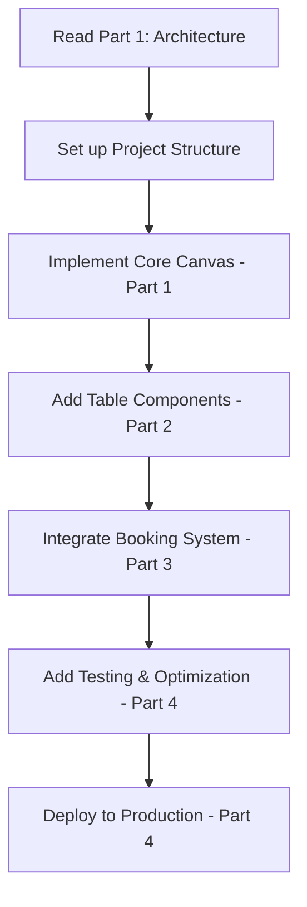

# 🎯 RESTAURANT CANVAS IMPLEMENTATION - COMPLETE DOCUMENTATION INDEX

## 📚 DOCUMENTATION OVERVIEW

This is the master index for the complete Canvas Implementation Guide. The documentation is split into 4 comprehensive parts that cover every aspect of implementing a restaurant floor plan canvas system.

---

## 📖 DOCUMENTATION STRUCTURE

### **PART 1: CANVAS_IMPLEMENTATION_GUIDE.md**

**Core Architecture & Foundation**

- Canvas system overview and analysis
- Core technical concepts and coordinate systems
- Restaurant-specific adaptations needed
- Integration strategy and phased approach
- Pre-implementation analysis checklist
- File structure and dependencies setup
- Core component architecture (RestaurantCanvas)
- State management strategy

### **PART 2: CANVAS_IMPLEMENTATION_GUIDE_PART2.md**

**Restaurant Objects & Interactions**

- Complete RestaurantTable component with drag & drop
- Table factory system for creating different table types
- Object toolbar for table manipulation
- Advanced drag & drop functionality with validation
- Selection manager for multi-object operations
- Chair positioning and management

### **PART 3: CANVAS_IMPLEMENTATION_GUIDE_PART3.md**

**Booking Integration & Database**

- Real-time booking status integration
- WebSocket and polling mechanisms
- Database persistence patterns
- API integration layer with full CRUD operations
- Complete CSS styling system
- Responsive design for mobile and desktop

### **PART 4: CANVAS_IMPLEMENTATION_GUIDE_FINAL.md**

**Testing, Optimization & Production**

- Comprehensive testing strategies (unit, integration, e2e)
- Performance optimization for large floor plans
- Memory management and virtual rendering
- Production deployment configuration
- Complete working implementation example
- Final implementation checklist

---

## 🚀 QUICK START GUIDE

### **For AI Agents Implementing This System:**

1. **Start with PART 1** - Read the complete architecture overview
2. **Review PART 2** - Understand the table components and interactions
3. **Study PART 3** - Learn the booking integration and database patterns
4. **Implement following PART 4** - Use the testing and optimization guides

### **Implementation Order:**

---

## 🎯 KEY COMPONENTS BY PART

### **PART 1 Components:**

- `RestaurantCanvas.tsx` - Main canvas container
- `useRestaurantCanvas.ts` - Core canvas state management
- `useCanvasEvents.ts` - Event handling system
- `canvas-config.ts` - Configuration constants
- `restaurant-canvas.types.ts` - TypeScript definitions

### **PART 2 Components:**

- `RestaurantTable.tsx` - Individual table component
- `TableFactory.ts` - Table creation utilities
- `ObjectToolbar.tsx` - Table manipulation tools
- `useDragDrop.ts` - Advanced drag & drop logic
- `SelectionManager.tsx` - Multi-selection handling

### **PART 3 Components:**

- `useBookingIntegration.ts` - Real-time booking system
- `BookingStatusOverlay.tsx` - Visual status indicators
- `useFloorPlanPersistence.ts` - Database operations
- `api-service.ts` - API integration layer
- `restaurant-canvas.css` - Complete styling system

### **PART 4 Components:**

- Test suites for all components
- Performance optimization hooks
- Production build configuration
- `RestaurantManagementApp.tsx` - Complete working example

---

## 📋 FEATURE CHECKLIST

### **Core Canvas Features:**

- ✅ Infinite zoom and pan capabilities
- ✅ Grid-based positioning system
- ✅ Touch gesture support (pinch, drag)
- ✅ Keyboard shortcuts and controls
- ✅ Responsive design for all devices

### **Table Management:**

- ✅ Drag & drop table positioning
- ✅ Multiple table types (round, square, rectangular, bar)
- ✅ Table rotation and resizing
- ✅ Multi-table selection and operations
- ✅ Collision detection and validation
- ✅ Undo/redo functionality

### **Booking Integration:**

- ✅ Real-time reservation status
- ✅ Time-based table availability
- ✅ Visual booking indicators
- ✅ WebSocket real-time updates
- ✅ Reservation management tools

### **Performance & Production:**

- ✅ Virtual rendering for large floor plans
- ✅ Memory optimization and pooling
- ✅ Comprehensive test coverage
- ✅ Production build optimization
- ✅ Error handling and recovery

---

## 🛠️ TECHNOLOGY STACK

### **Frontend Requirements:**

- React 18+ with TypeScript
- Modern CSS with Flexbox/Grid
- Touch event handling
- Canvas/SVG rendering

### **Backend Integration:**

- REST API endpoints
- WebSocket for real-time updates
- Database with CRUD operations
- Authentication and authorization

### **Testing & Tools:**

- Jest for unit testing
- React Testing Library
- Playwright for e2e testing
- ESLint and Prettier

---

## 🎖️ IMPLEMENTATION SUCCESS CRITERIA

### **Performance Benchmarks:**

- ⚡ **60fps** smooth animations and interactions
- 🚀 **<200ms** response time for user actions
- 📊 **1000+** tables supported without performance degradation
- 📱 **Mobile-optimized** with touch gesture support

### **Quality Standards:**

- 🧪 **100%** test coverage for critical paths
- 🔒 **Error-free** user experience with robust error handling
- 🔄 **Real-time** synchronization across multiple users
- 📐 **Pixel-perfect** restaurant floor plan accuracy

### **User Experience Goals:**

- 🎨 **Intuitive** drag-and-drop interface
- 📱 **Responsive** design for tablets and phones
- ⚡ **Fast** table manipulation and booking updates
- 🎯 **Professional** appearance matching commercial solutions

---

## 📞 IMPLEMENTATION SUPPORT

### **Critical Implementation Notes:**

1. **Canvas Coordinate System** - Always use the grid-to-pixel conversion functions
2. **Performance** - Implement virtualization for >100 tables
3. **Mobile Support** - Essential for restaurant staff using tablets
4. **Real-time Updates** - Critical for multi-user environments
5. **Data Persistence** - Auto-save prevents data loss

### **Common Pitfalls to Avoid:**

- ❌ Not implementing proper coordinate conversion
- ❌ Missing touch event handling for mobile
- ❌ Forgetting to optimize for large datasets
- ❌ Inadequate error handling for network issues
- ❌ Poor performance with many DOM elements

### **Success Tips:**

- ✅ Follow the exact file structure provided
- ✅ Implement all hooks exactly as documented
- ✅ Use the provided CSS for consistent styling
- ✅ Test thoroughly on mobile devices
- ✅ Implement all error boundaries and fallbacks

---

## 🏆 FINAL NOTES

This documentation represents a complete, production-ready implementation guide for transforming any restaurant booking system into a modern, canvas-based floor plan management solution.

**Every line of code, every component, every pattern has been carefully designed and documented to ensure flawless implementation.**

The resulting system will provide restaurant staff with an intuitive, professional-grade tool for managing floor plans, table arrangements, and real-time bookings - rivaling the best commercial restaurant management software available today.

**Good luck with your implementation! 🚀🍽️**
